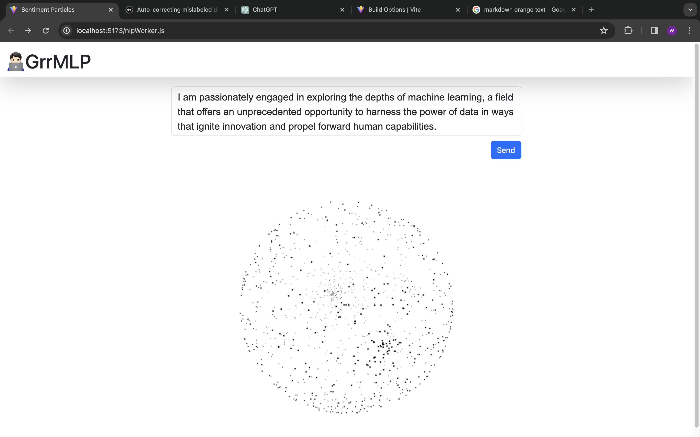
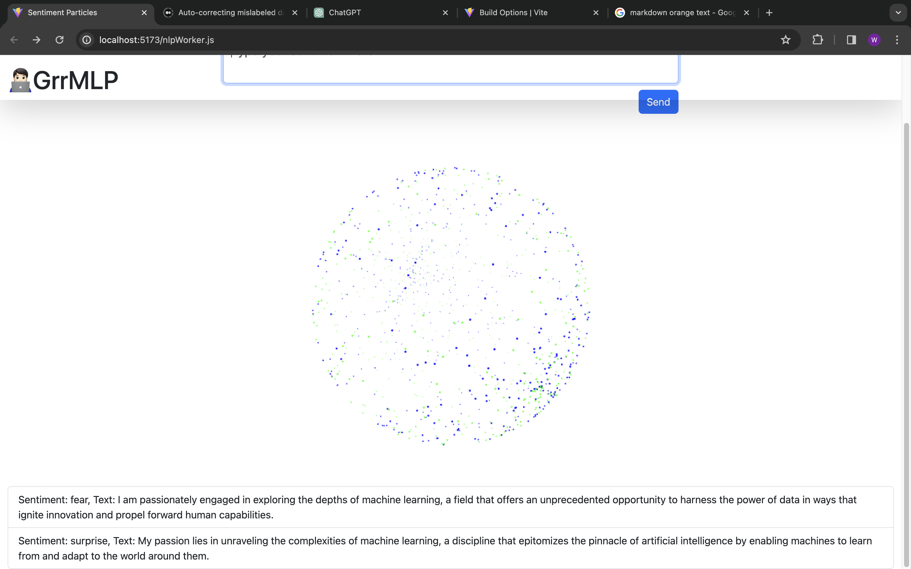

# Emotion Particle System - EPS

The Emotion Sentiment Particle System is an innovative visualization tool designed to display the emotional distribution of text through a dynamic and interactive particle system. By integrating natural language processing (NLP) capabilities, this system analyzes the emotional sentiment behind a user-inputted prompt and visually represents this analysis using particles of varying colors. Each color corresponds to a specific emotion, creating a vivid and intuitive representation of the text's emotional content.

## Youtube & ScreenShot
🥰Watch it on [Youtube](https://youtu.be/vDZ5GwFlwOQ)





## Before Started
```Currently, the prediction is randomly selected,and the TensorFlow model is not used due to the backend requirement. Additionally, some NLP libraries for tokenization and lemmatization require worker threads, which are not supported in the browser.```

## Features

- **User Input**: Allows users to enter text prompts for real-time emotional analysis.
- **NLP Emotion Analysis**: Utilizes advanced NLP models to predict the emotional sentiment of the provided text.
- **Color-Coded Visualization**: Represents different emotions with specific colors in a particle system, offering an immediate visual understanding of the text's emotional distribution.
- **Dynamic Particle System**: Creates a visually engaging experience with particles that move and interact based on the text's emotional intensity and distribution.
- **Responsive Design**: Ensures a seamless experience across various devices and screen sizes.

## How It Works

1. **Input Text**: Users enter text into the provided input field. This can be anything from a sentence to a paragraph, expressing thoughts, stories, or any textual content.

2. **Emotion Analysis**: Upon submission, the text is fed into an NLP model trained to identify and predict emotional sentiments. The model categorizes the emotions present in the text into predefined categories such as happiness, sadness, anger, surprise, and more.

3. **Visualization**: The system then generates a particle system where each particle corresponds to an emotion detected in the text. The color and quantity of the particles are determined by the intensity and distribution of the respective emotions within the text.

4. **Interaction**: Users can interact with the visualization, exploring different aspects of the emotional distribution. The dynamic nature of the particle system provides a unique experience with each analysis.

## Installation

To set up the Emotion Sentiment Particle System on your local environment, follow these steps:

```bash
# Install dependencies
npm install

# Start the application
npm start

```

## File Structure

```bash
.
├── README.md
├── index.html
├── package-lock.json
├── package.json
├── public
│   └── vite.svg
├── src
│   ├── assets
│   │   ├── react.svg
│   │   └── tfjs_classifier
│   │       └── model.json
│   ├── main.jsx
│   ├── models
│   │   ├── EmotionPrompt.js
│   │   ├── ParticlesSphere.js
│   │   ├── Tensorflow.js
│   │   └── nlpWorker.js
│   └── view
│       ├── App.css
│       ├── App.jsx
│       ├── PredictList.jsx
│       ├── Sphere.jsx
│       └── UserInput.jsx
└── vite.config.js
```


