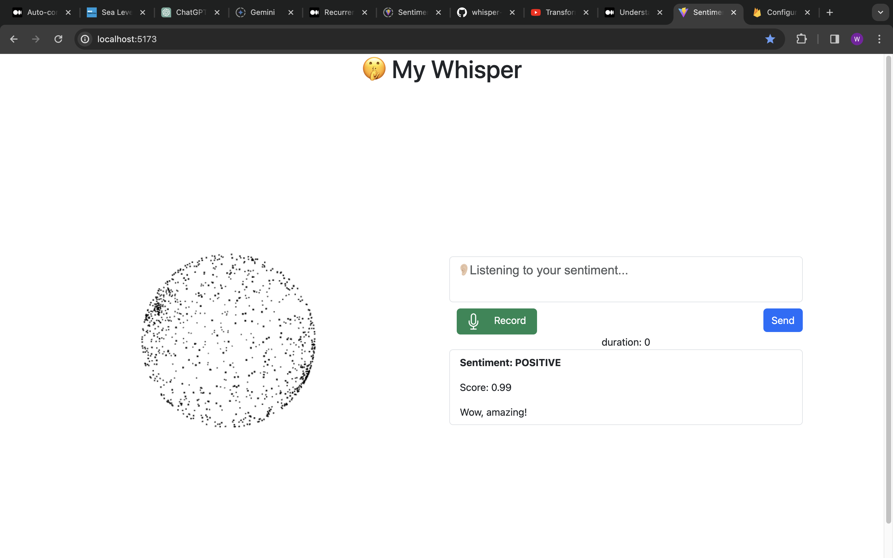
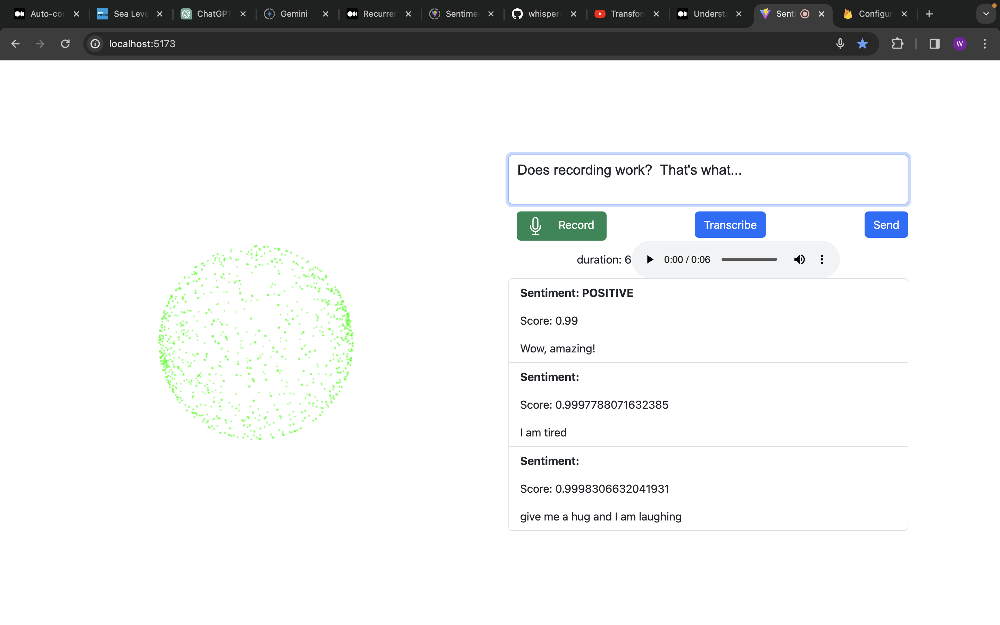
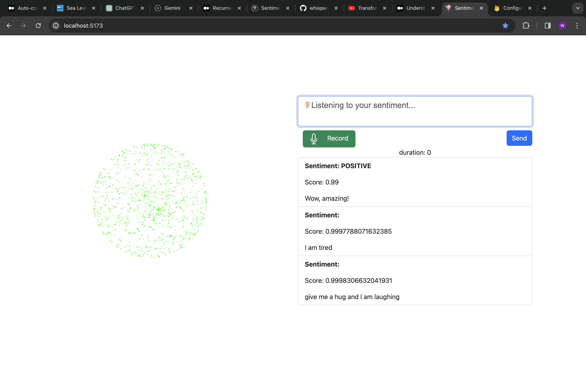
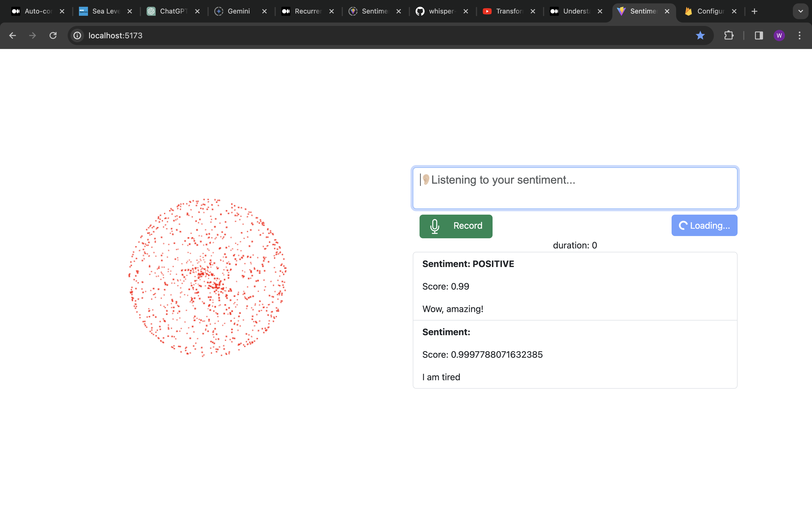

# Voice Particle System - VPS

The Voice Sentiment Particle System is an innovative visualization tool designed to display the emotional distribution of text through a dynamic and interactive particle system. By integrating natural language processing (NLP) capabilities, this system analyzes the emotional sentiment behind a user-inputted prompt and visually represents this analysis using particles of varying colors. Each color corresponds to a specific emotion, creating a vivid and intuitive representation of the text's emotional content.

## Cypress Testing
1. Test text area should take inputs.
2. Test List has items.
3. Test List properly render items after user add one.
4. Test List shows properly text.
5. Test time duration function correctly when recording.

## Youtube
🥰Youtube Showcase [Youtube](https://youtu.be/hps0so4NSJc)
Youtube Cypress [Youtube](https://youtu.be/hZU07kvV5Vg)






## Features

- **Sentiment Analysis**: Utilize Huggingface NLP models to predict the sentiment of the provided text.
- **Whisper Voice to text**: Utilize the Huggingface whisper model to transcribe audio to text.

## Documentation
[Project Design Documentation](./VoiceParticleSystem.pdf)

## Installation

To set up the Voice Particle System on your local environment, follow these steps:

```bash
# Install dependencies
npm install

# Start the application
npm run dev

```

## File Structure

```bash
.
├── README.md
├── firebase.json
├── index.html
├── package-lock.json
├── package.json
├── public
│   └── vite.svg
├── src
│   ├── App.jsx
│   ├── assets
│   │   └── react.svg
│   ├── audio.worker.js
│   ├── hooks
│   │   ├── useAudioManager.js
│   │   ├── useFirebase.js
│   │   ├── useSentiment.js
│   │   ├── useTranscriber.js
│   │   └── useWorker.js
│   ├── main.jsx
│   ├── models
│   │   ├── Emotion.js
│   │   ├── Firebase.js
│   │   └── ParticleSphere.js
│   ├── sentiment.worker.js
│   ├── utils
│   │   ├── BlobFix.js
│   │   └── Constants.js
│   └── view
│       ├── AudioManager.jsx
│       ├── AudioRecorder.jsx
│       ├── ParticleSphere.jsx
│       ├── PredictList.jsx
│       ├── Transcript.jsx
│       └── UserInput.jsx
└── vite.config.js
```


